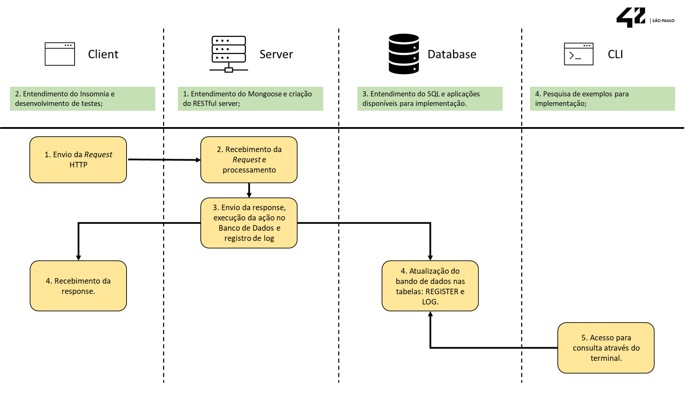

<div aligns="center">

</div>

# API de Cadastro

 A API de Cadastro permite que o usuário efetue o cadastro de novos usuários com os seguintes campos:
- name: formato Text;
- email: formato Text;
- password: formato Text;
 A aplicação funciona foi implementada em RESTfull e recebe os comandos GET, POST, PUT e DELETE, efetuando assim consulta, inclusão, alteração e exclusão de registro. Os logs de todas as requisições ficam armazenados no arquivo log.txt na pasta log.
 Foram utilizadas as seguintes ferramentas:
- Mongoose: Criação de servidor para recebimento/resposta de requisições HTTP. É uma tecnologia que funciona de forma satisfatória com aplicações construídas em C. Foi avaliado o uso da libeom (https://github.com/ericomeehan/libeom), porém dado o prazo, foi deixado em segundo plano.
- SQLite: Criação de banco de dados, criação/alteração/exclusão de registros em nase de dados, além de consultas. A escolha foi feita pela possibilidade de salvar os binários junto dos arquivos da API, evitando a necessidade de instalação pelo usuário. Além de ser uma aplicação leve e com considerável documentação, tutoriais e exemplos disponíveis.
- libft: Foi utilizada a biblioteca feita por mim para um dos projetos da 42SP na facilitação da construção de funções da api. A escolha se deu pela maior familiaridade com as funções, evitando desperdício de tempo.
- Docker: Criação de contâiner para facilitar o compartilhamento/acesso à aplicação em ambiente já preparado.
- Insomnia: utilização da aplicação para efetuar os testes das requisições.
- script.sh: script que efetua requisições na aplicação com o uso do wget.

```sh
#Para utilizar a API você pode:
#Criar um container com o seguinte comando:
docker run -p 8080:8000 -d --name 42labs

#Clone e build do repositório em sua máquina:
git clone https://github.com/42sp/42labs-selection-process-v2-takeshinishikawa.git
make run
```
## CLI42

 A CLI42 foi feita para facilitar a consulta dos logs criados pela API de Cadastro.
 Atualmente, é possível verificar o menu de opções/ajuda digitando os seguintes comandos:
```sh
cli42
cli42 help
```
 Quantidade de requests por tipo (GET/POST/PUT/DELETE/PATCH):
```sh
cli42
cli42 method
```
 Quantidade de requests por status (Ex: 200, 400, etc):
```sh
cli42
cli42 status
```
 Buscar o nome de um usuário, informando o email:
```sh
cli42
cli42 name <nome do usuário>
```
Buscar um email, informando o nome de usuário:
```sh
cli42
cli42 email <email do usuário>
```

## Próximos passos
- Criação de uma página de cadastros acessada através do browser, consumindo a API de Cadastro;
- Elaboração/aplicação de novos casos de teste;
- Implementação de chaves de segurança;
- Cache básico(caso sua API se comunique com banco de dados)
- Autenticação e autorização(API)
- Lidar com requests simultâneos(API)
- Cuidados especiais com otimização, padrões, entre outros
- Pipelines de CI/CD
- Utilização de algum serviço de computação na nuvem

